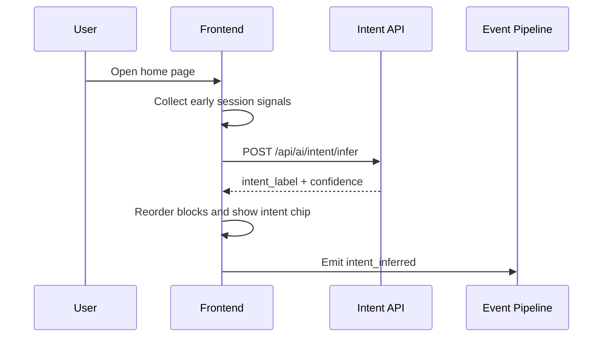
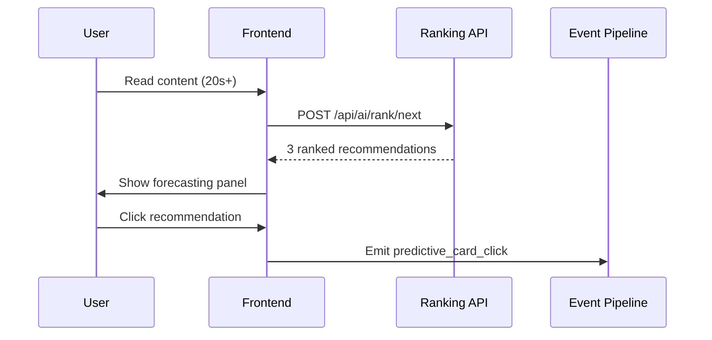
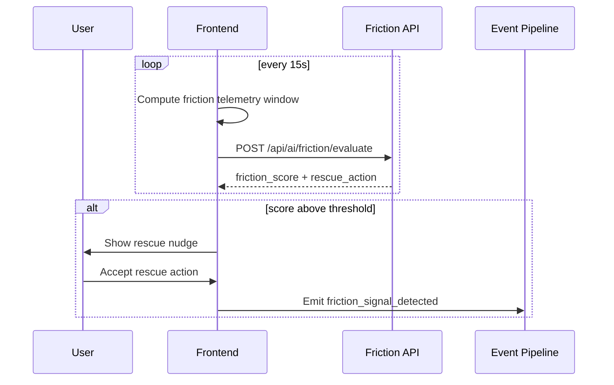
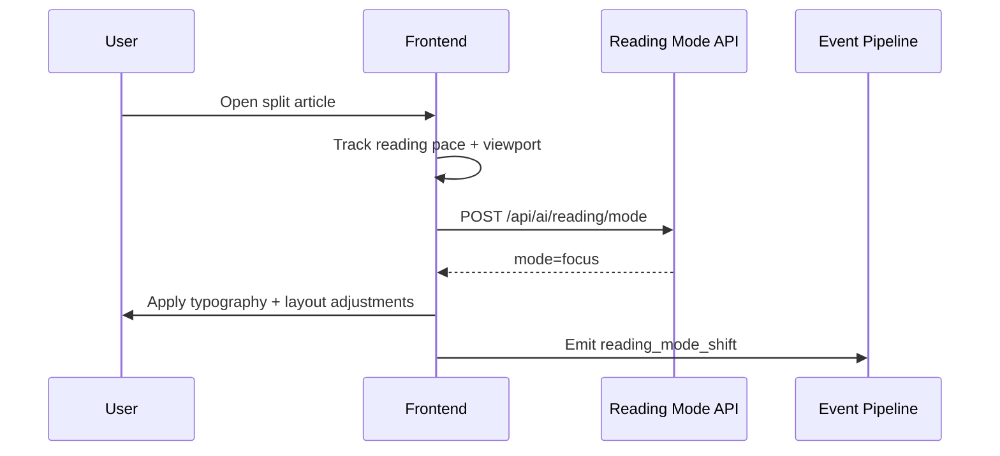
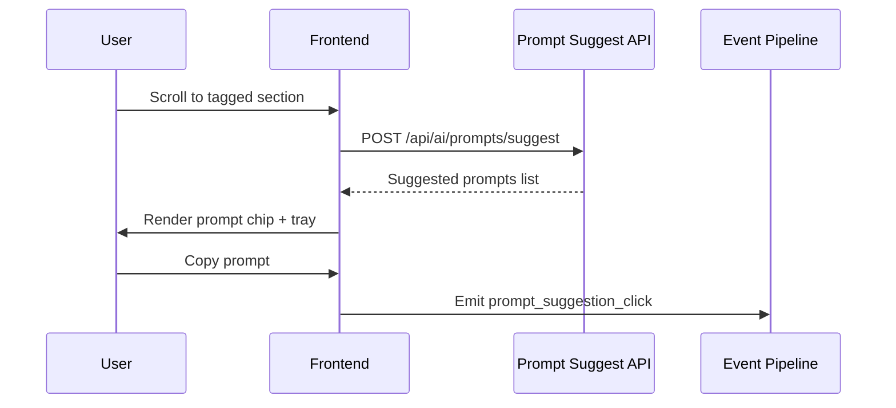

# Sequence Diagrams

## F01 Intent Radar + Adaptive Surface

## F02 Predictive Content Forecasting Panel

## F04 Friction Sentinel + Rescue UI

## F05 Adaptive Reading Mode

## F07 Inline Prompt Suggestion Engine

