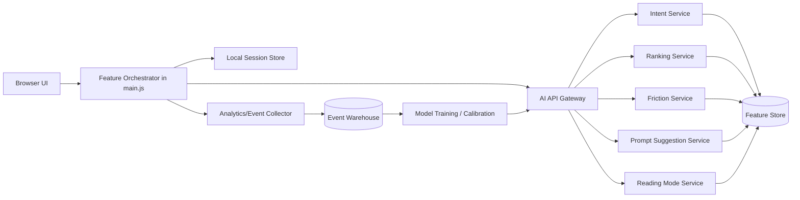

# System Architecture Flow

## High-level architecture

## Runtime flow summary
1. Browser orchestrator captures interaction and context signals.
2. Local decisions run immediately for low-latency behavior.
3. AI API calls provide higher quality inference and ranking where available.
4. Event collector records outcomes and feeds model calibration loop.
5. If AI services degrade, UI falls back to deterministic rules.

## Degradation and fallback strategy
- Priority 1: maintain navigation and reading UX.
- Priority 2: maintain deterministic recommendation logic.
- Priority 3: disable only model-assisted enhancements.
